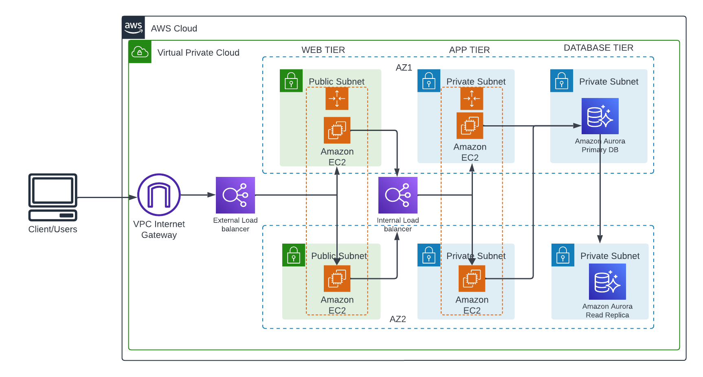

# AWS Cloudops Challenge Week 2

Hello Everyone, I am participating in [10 weeks of CloudOps Challenge](https://github.com/piyushsachdeva/10weeksofcloudops/blob/main/README.md) by [Piyush Sachdeva](https://www.linkedin.com/in/piyush-sachdeva/) and here is my AWS challenge for the First week

## Creating and Deploying Three tier Application in AWS

I wrote about it in this [blog post](https://blog.mmuyideen.xyz)

